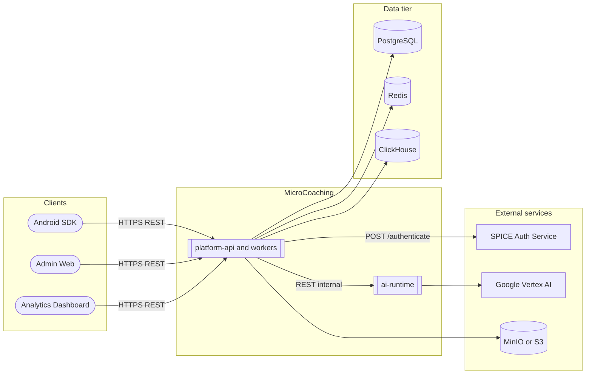
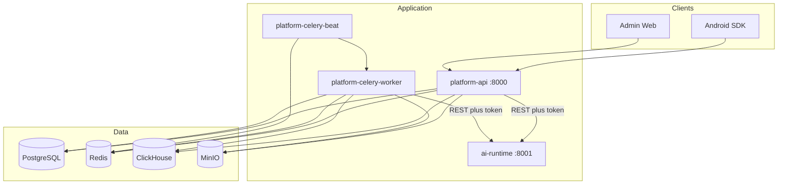
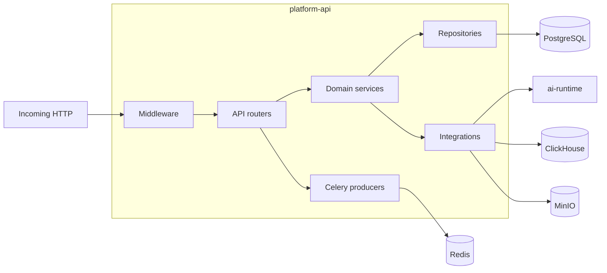

# Architecture

MicroCoaching sits between mobile CHW clients and cloud AI infrastructure. The Android SDK and admin web clients call platform-api. platform-api stores product state and delegates raw LLM calls to ai-runtime.

## External dependencies

| System | Used by | Purpose | Connection |
|---|---|---|---|
| SPICE auth-service | platform-api | JWT validation | `POST {SPICE_AUTH_BASE_URL}/authenticate` |
| Google Vertex AI / Gemini | ai-runtime | Inference, vision, transcription, embeddings | SDK via ADC or API key |
| MinIO / S3 | platform-api, workers | Source documents, thumbnails, admin files | S3-compatible API |
| Analytics dashboard | Browser | Program-manager analytics UI | Calls platform dashboard routes |

## Users and clients

| Actor | Calls | Purpose |
|---|---|---|
| CHW Android SDK | `/coaching`, `/sync`, `/telemetry`, `/morning` | Offline sync, coaching RAG, telemetry, morning cards |
| Admin / reviewer web | `/admin/*` | Ingest, modules, assignments, pipeline runs |
| [Program Organizer](../GLOSSARY.md#program-organizer) / [Area Manager](../GLOSSARY.md#area-manager) | `/dashboard/*` | Dashboard analytics |
| platform-celery-worker | Redis broker | Background ingest and telemetry jobs |
| platform-api | ai-runtime internal API | Generation, embedding, transcription |

## Technology stack

See `pyproject.toml` and `uv.lock` for locked library versions.

| Category | Technology | Purpose |
|---|---|---|
| Language | Python | All services and packages |
| Package manager | uv | Workspace lock and multi-package sync |
| Web framework | FastAPI | HTTP APIs for platform-api and ai-runtime |
| ORM | SQLAlchemy async | PostgreSQL access in platform |
| Migrations | Alembic | Schema changes. Run as a separate step. |
| Vector search | Module embedding store | Module embeddings for RAG. Default adapter is pgvector. |
| Primary DB | PostgreSQL | System of record |
| Analytics DB | ClickHouse | Telemetry events and dashboard views |
| Queue broker | Redis | Celery broker and rate-limit state |
| Task queue | Celery | Ingest, post-publish, telemetry drain |
| Object storage | MinIO or AWS S3 | PDFs, thumbnails, ingest artifacts |
| AI providers | google-genai in ai-runtime only | LLM inference and embeddings |
| Auth | SPICE middleware | Authentication. DB role to route for authorization. |
| Observability | python-json-logger, request IDs | Structured logs and correlation |
| CI | GitHub Actions | Lint, security scan, typecheck, tests |
| Containers | Docker Compose | Local full stack |

Service images use `python:3.12-slim`. Healthchecks use a Python `urllib` probe. The image has no `curl`.

## Container architecture

| Unit | Purpose |
|---|---|
| platform-api | Public HTTP API on port 8000 under `/medtronics-api` (`API_ROOT_PATH`). Owns product writes and orchestration. |
| platform-celery-worker | Ingest pipeline, post-publish jobs, telemetry processing, thumbnail generation, telemetry buffer drain. No HTTP. |
| platform-celery-beat | Scheduled jobs for telemetry drain, chat FAQ aggregation, feedback summaries, and module-creation suggestion refresh. |
| ai-runtime | Stateless generation, embedding, and transcription on port 8001. Depends on AI provider credentials only. |
| migrate | Runs `alembic upgrade head` once, then exits. |

Compose host ports: [Deployable units](../administration/deployable-units.md). Directories: [Where to change code](where-to-change-code.md).

## Platform internals

Platform uses a layered pattern: FastAPI routers, domain services, repositories, SQLAlchemy models. Auth, rate limiting, and dependency injection sit in middleware. All AI calls go through `AIRuntimeClient`.

Route groups live under `API_ROOT_PATH`. See [Route index](../api-reference/endpoints.md).

## ai-runtime internals

ai-runtime is thin. It validates an internal token, routes to a provider adapter, and returns a structured response. It does not persist product state. Devices do not call these routes.

| Endpoint | Purpose |
|---|---|
| `POST /internal/generate/{generation_type}` | Unified generation. The generation type selects the prompt and parser. |
| `POST /internal/embed` | Text embeddings |
| `POST /internal/transcribe` | Media transcription |
| `GET /health` | Liveness |

## RAG eval harness

`eval` is a CLI library. It is not a deployable service. See [RAG evaluation](rag-evaluation.md).

## Next step

[Data and workflows](data-and-workflows.md)
