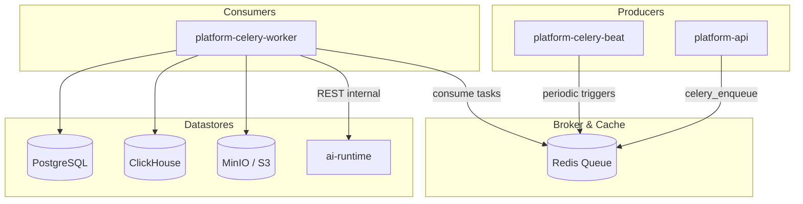

# Background Tasks & Workers

Celery on Redis runs ingest, post-publish, telemetry, and scheduled Beat jobs. `platform-api` and `platform-celery-beat` enqueue by task name with `celery_enqueue`; `platform-celery-worker` consumes from Redis.

## Worker processes

The stack runs two dedicated background processes:

1. **`platform-celery-worker`**: Consumes task queues and executes coroutines for ingestion, enrichment, telemetry processing, and retry operations. Does not serve HTTP traffic.
2. **`platform-celery-beat`**: Runs periodic scheduler heartbeats that dispatch maintenance, aggregation, and buffer-draining tasks at configured intervals.

## Task catalogue

All 17 Celery task entrypoints are defined in `platform_service.celery_tasks` and mapped to canonical task name constants in `platform_service.task_names`.

### 1. Ingest pipeline tasks

| Task name constant | Task function | Purpose |
|---|---|---|
| `RUN_INGEST_BATCH` | `run_ingest_batch_job` | Drives the multi-source ingest batch through extraction, candidate identification, merging, and card drafting. |
| `RETRY_INGEST_PIPELINE` | `run_pipeline_for_source_job` | Retries failed stages for a specific source document run. |
| `RETRY_INGEST_CANDIDATE_MERGE` | `run_candidate_merge_job` | Re-executes the candidate merge stage across multiple sources. |

### 2. Post-publish enrichment tasks

When a module is published (or drafted), post-publish workers enrich the module asynchronously:

| Task name constant | Task function | Purpose |
|---|---|---|
| `GENERATE_SOURCE_THUMBNAIL` | `generate_source_thumbnail_job` | Generates cover thumbnails from PDFs or media sources. |
| `GENERATE_MODULE_QUIZ` | `generate_quiz_for_module` | Calls `ai-runtime` to generate formative quiz questions (skipped in `read_only` mode). |
| `GENERATE_MODULE_EMBEDDING` | `generate_embedding_for_module` | Computes cloud and local module embeddings for vector search. |
| `GENERATE_MODULE_SEARCH_METADATA` | `generate_search_metadata_for_module` | Extracts keywords, synonyms, and clinical condition tags under primary locale. |
| `GENERATE_MODULE_CARD_SEARCH_METADATA_BATCH` | `generate_card_search_metadata_batch` | Generates search metadata per card. |
| `CLASSIFY_MODULE_GAPS` | `classify_module_gaps_for_module` | Classifies and tags the module against defined behavioural gaps. |
| `BIND_ASSESSMENT_TRIGGERS` | `bind_assessment_triggers_job` | Binds published modules to workflow event triggers based on topic taxonomy. |

### 3. Telemetry processing tasks

When the SDK posts telemetry batches via `POST /telemetry/events`, the HTTP API immediately acknowledges accepted events and enqueues operational side-effects:

| Task name constant | Task function | Purpose |
|---|---|---|
| `PROCESS_MODULE_EVENT` | `process_module_event_job` | Updates module completion status, CHW progress, and awards learning points for views/quizzes. |
| `PROCESS_TRAINING_REQUEST_EVENT` | `process_training_request_event_job` | Creates per-user assignments when a CHW requests a published module via telemetry. |
| `PROCESS_VIDEO_PROGRESS_EVENT` | `process_video_progress_event_job` | Monotonically updates video watch positions and percentages. |

### 4. Periodic Beat tasks

Celery Beat triggers these maintenance tasks according to configured schedules:

| Task name constant | Default schedule | Purpose |
|---|---|---|
| `DRAIN_TELEMETRY_BUFFER` | Every 60s (`telemetry_buffer_drain_interval_seconds`) | Flushes events from the Redis fallback buffer to ClickHouse after transport failures. |
| `AGGREGATE_CHAT_FAQS` | Periodic | Mines frequent questions from `digital_help_used` telemetry into ranked FAQ chips. |
| `AGGREGATE_CHAT_FEEDBACK_SUMMARY` | Periodic | Aggregates CHW ratings and feedback for supervisor review. |
| `REFRESH_MODULE_CREATION_SUGGESTIONS` | Daily | Analyzes unattributed chat questions and requests to generate daily module creation suggestions. |

## Resiliency and the Redis fallback buffer

ClickHouse is optimized for high-throughput analytical inserts. If ClickHouse experiences a transient network blip or restart:

1. `POST /telemetry/events` receives a transport error on write.
2. The endpoint pushes the raw event IDs and payloads into a Redis buffer (`telemetry:buffer:list`).
3. The HTTP response marks the events as `buffered` in the response envelope (`200 OK`).
4. The background task `DRAIN_TELEMETRY_BUFFER` periodically drains up to `telemetry_buffer_drain_batch_size` (default 100) items from Redis and retries the batch insert into ClickHouse.

This guarantees zero data loss on device telemetry during database maintenance windows.

## Next step

[Data and workflows](data-and-workflows.md)
