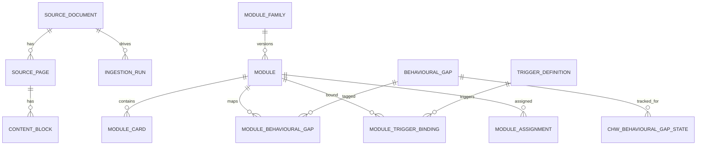
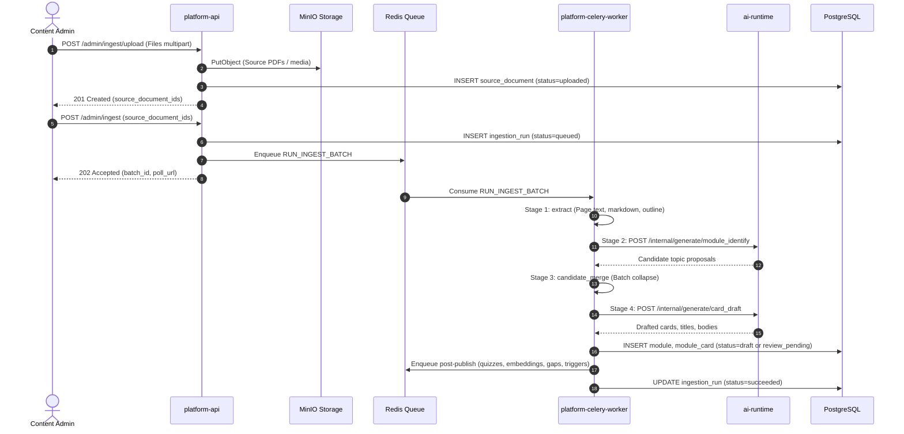

# Data and workflows

Concept entities, stores, and the main product workflows.

## Concept entities

| Concept | Meaning |
|---|---|
| Tenant | SPICE country. Parent tables carry `tenant_id`. |
| Source document | Uploaded file. Ingest source or knowledge library. |
| Source page | Per-page markdown from extract. |
| Content block | Citation primitive linking cards back to source text. |
| Module family | Stable identity across content versions. |
| Module | One coaching topic. Lifecycle: `draft`, `review_pending`, `published`, `deactivated`, `retired`. |
| Card | One screen. `card_family_id` is stable across versions. |
| Quiz question | Generated after publish unless `assessment_mode` is `read_only`. |
| Assignment | Module or document granted to a user or geography. |
| Hierarchy user | Area Manager, Program Organizer, or CHW in a district. |
| Behavioural gap | Definition plus per-CHW state. Synced to the device. |
| Trigger | Workflow predicate plus module bindings. |
| Badge | Learner achievement linked to published modules. |
| Ingestion run | Batch and stage progress for admin poll. |

## Data stores

| Store | Purpose | Access |
|---|---|---|
| PostgreSQL | Modules, ingest runs, gaps, CHW state, LLM cache, default vectors | Async SQLAlchemy. Platform only. |
| Module embedding store | Embedding upsert and search | Platform. Default adapter is pgvector on `module.embedding`. |
| ClickHouse | Telemetry events and dashboard views | Batch insert on ingest. Dashboard reads. |
| Redis | Celery broker, rate-limit counters, ingest dedup | Async Redis client in API |
| Object storage | Source files, thumbnails, admin uploads | Presigned GET for devices |

The module is the unit of meaning. Cards are rows in `module_card` with stable `card_family_id` and `card_version`. `module.module_json` holds module-level attachments and metadata. Content versioning uses `module_family_id` plus `module.version`. Parent tables carry `tenant_id`. See [Multi-tenancy](../administration/multi-tenancy.md).

Actor columns store a bigint `users.id` with no foreign key. Reads return `UserActorRef` (`id`, `name`). If the user row is missing, actor DTOs are `null`. The stored bigint remains.

## Admin document ingest

Admin uploads source files. platform-api stores them and creates `source_document` rows. `POST /admin/ingest` enqueues a Celery batch. Workers run extract, module identify, candidate merge, and card draft. Post-publish workers generate quizzes, embeddings, gap classifications, and trigger bindings. See [Ingest pipeline](../content-administration/ingest-pipeline.md) and [Background tasks & workers](background-tasks.md).

## Coaching RAG

1. SDK calls `POST /coaching/rag-query`.
2. Greeting, chit-chat, or crisis-looking messages may take a chat route and skip retrieval.
3. Otherwise platform embeds the question through `POST /internal/embed`.
4. Platform searches published modules through the module embedding store.
5. Platform calls `POST /internal/generate/coaching_rag`.
6. Platform returns the JSON answer with source attribution.

## Telemetry ingest

1. SDK calls `POST /telemetry/events`.
2. Platform validates the batch and checks Redis rate limits.
3. Platform attempts batch insert of accepted rows to ClickHouse.
4. If ClickHouse experiences a transient failure, platform buffers rows to Redis (`telemetry:buffer:list`) and marks events as `buffered` in the HTTP response.
5. The Celery Beat job `DRAIN_TELEMETRY_BUFFER` retries the ClickHouse insert.
6. Platform enqueues Celery background tasks for operational side-effects: `PROCESS_MODULE_EVENT`, `PROCESS_TRAINING_REQUEST_EVENT`, and `PROCESS_VIDEO_PROGRESS_EVENT`.
7. Celery workers update PostgreSQL state (learning points, module completions, gap states).

See [Send telemetry](../device-coaching/send-telemetry.md) and [Background tasks & workers](background-tasks.md).

## Sync

The SDK calls delta sync routes under `/sync`. `GET /sync/modules` includes `assigned_module_ids` and `requested_modules` for the authenticated CHW. See [Sync](../api-reference/sync.md).

## Next step

[Decisions](decisions.md)
