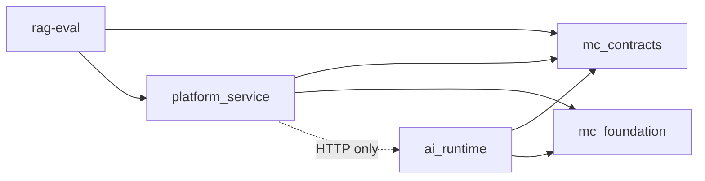

# Decisions

Architectural decisions, cross-cutting concerns, and the allowed import graph.

## Architectural decisions

### Split platform and ai-runtime

Platform needs durable state. LLM providers change often and have heavy SDKs. Two services communicate through `AIRuntimeClient` and a shared internal token.

### Module-centric model

A module is the unit of meaning. Cards are presentation slices in `module_card`. Device sync uses `/sync/*`.

### Dual-path merge on similar published modules

When card draft finds a similar active module, it writes a review-pending pair in two new families. The matched published module stays active until an admin overrides or splits. See [Review dual-path merges](../content-administration/review-merges.md).

### Unified internal generation endpoint

ai-runtime exposes `POST /internal/generate/{generation_type}`. The generation type selects the prompt and parser.

### Polyglot persistence

PostgreSQL is OLTP. ClickHouse is telemetry OLAP. Redis is the queue broker. Object storage holds blobs. There is no distributed transaction across stores.

### No Celery result backend

Task outcomes persist in PostgreSQL. Admin poll endpoints read `ingestion_run` tables.

## Cross-cutting concerns

### Authentication and authorization

Auth procedure: [Authentication](../device-integration/authentication.md). Grant table: [Roles and access](../concepts/roles-and-access.md). Problem Details: [Authentication and errors](../api-reference/authentication-and-errors.md).

### Error handling

HTTP errors return RFC 7807 Problem Details. `type` is `docs/error-codes.json#{code}`. Clients map `code` to user-facing copy. `detail` is technical text. Do not move `docs/error-codes.json`.

### Observability

Logging writes JSON to stdout. When `LOG_DIR` is set, it also writes rotated files per service. Request-id middleware sets `X-Request-ID` on both services.

### Configuration

Settings are Pydantic Settings classes. Alembic never runs at app startup. Environment variables: [Configuration](../administration/configuration.md).

## Allowed import graph

Forbidden:

- ai-runtime imports platform
- platform imports LLM SDKs
- foundation contains SQLAlchemy models
- contracts contain runtime behaviour

## Next step

[Where to change code](where-to-change-code.md)
